### Integration between GitLab, Terraform and Apstra

### Table of contents
* [Software Overview](Readme.md#Software-Overview)
  * [Apstra](Readme.md#Apstra)
  * [Terraform](Readme.md#Terraform)
  * [GitLab](Readme.md#GitLab)
* [Lab Installation](Readme.md#Lab-Setup)
  * [IP Clos Fabric](Readme.md#IP-Clos-Fabric)
  * [Apstra](Readme.md#Apstra)
  * [GitLab](Readme.md#GitLab)
* [DevNetOps in Action ](Readme.md#DevNetOps-in-Action)

### Software Overview
Let's start with a brief introduction to the software required for the lab setup.

#### Apstra
Juniper [Apstra](https://www.juniper.net/us/en/products/network-automation/apstra.html) is an intent-based based network management platform that configures and monitors devices from different vendors via Netconf, gRPC and other protocols. It utilizes a Graph database to store and represent all information about the network which is modeled as nodes and relationships between them. 

#### Terraform
[Terraform](https://www.terraform.io/) by HashiCorp is a software tool that allows you to manage external systems by declaring resources you want to create, read, update or delete (CRUD operations). Terraform's declarative approach eliminates the need to consider the sequence of specific commands to achieve the desired state. Terraform interacts with the external systems through [providers](https://registry.terraform.io/browse/providers). You only need to specify the final state, and the Terraform provider will determine the actions required to bring the external system to that state. Juniper has deleveloped a provider for Apstra, the source code and configuration examples can be found [here](https://github.com/Juniper/terraform-provider-apstra).
 
#### GitLab
[GitLab](https://about.gitlab.com/) is a powerful code repository and collaborative software delevelopment platform that allows you to create your own CI/CD pipelines. Its [integration with Terraform](https://docs.gitlab.com/ee/user/infrastructure/iac/) enables you to manage your network infractructure as a code, following DevNetOps approach.

### Lab Setup
The lab setup comprises the following components:

* IP Clos fabric based on Juniper vEXs
* Apstra VM
* GitLab software

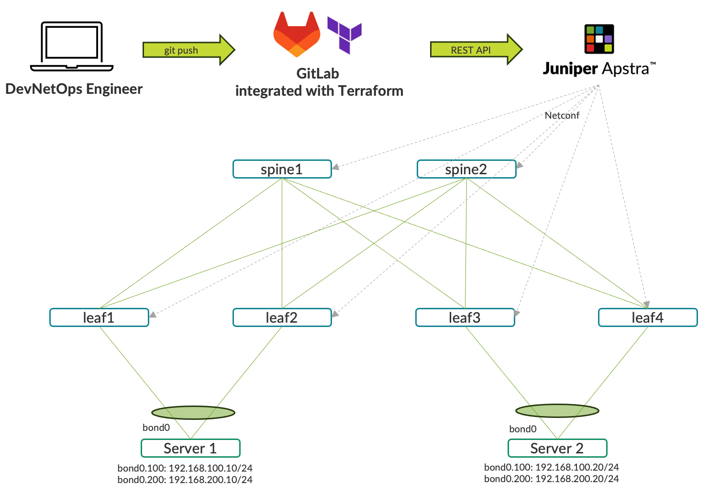

Let's look into the configuration of each component:

#### IP Clos Fabric
It's a simple Clos fabric with 2 spines, 4 leaves and 2 servers connected to pairs of leaves with aggregated interfaces. To simplify the deployment of virtual devices and networks I'm using the [containerlab](https://containerlab.dev/) project. All you need to do is to create a [topology file](https://github.com/agantonov/clab/blob/main/clos-fabric/clos-fabric.yml) and execute the command below:
```
$ sudo clab deploy -t clos-fabric.yml
```
The servers are represented by Docker containers based on Ubuntu 22.04. You can either create your own images or reuse my *Dockerfile* [file](https://github.com/agantonov/docker/blob/main/ubuntu-host/Dockerfile) to build the image with the following command:
```
$ sudo docker build --tag ubuntu-host:0.01 -f ubuntu-host/Dockerfile .
```
#### Apstra
The Apstra installation guide can be found [here](https://www.juniper.net/documentation/us/en/software/apstra4.2/apstra-install-upgrade/topics/topic-map/apstra-server-install-kvm.html). You should have a Juniper account to be able to download the image and then run the VM with the following command:
```
sudo virt-install --import --name apstra_clab --memory 65536 --vcpus 8 --disk apstra_clab.qcow2,format=qcow2,bus=virtio --network bridge=fabric-mgmt,model=virtio --osinfo=ubuntu22.04 --graphics spice --noautoconsole
```

#### GitLab
Installation steps for GitLab are described [here](https://about.gitlab.com/install/#ubuntu). The only potencial difficulty you may encounter is a self-signed certificate which you need to generate and copy to */etc/gitlab/ssl/* folder as explained [here](https://docs.gitlab.com/omnibus/settings/ssl/index.html#configure-https-manually). To enable the execution of CI/CD jobs in the background, you need to install [GitLab Runner](https://docs.gitlab.com/runner/) and [register](https://docs.gitlab.com/runner/register/index.html) it with the GitLab instance. Instructions on how to do this can be found [here](https://docs.gitlab.com/ee/ci/runners/runners_scope.html#create-a-project-runner-with-a-runner-authentication-token). During the registration process you have to choose an [*executor*](https://docs.gitlab.com/runner/executors/docker.html). In my lab I'm using a *Docker* executor.

Since my GitLab instance is configured with a self-signed SSL certificate, I have to copy the SSL certificate every time the Docker executor is required to run. To accomplish this I have added the following commands to the ``/etc/gitlab-runner/config.toml`` file:
```
[[runners]]
...

  # Copy and install CA certificate before each job
  pre_build_script = """
  apk update  > /dev/null
  apk add ca-certificates > /dev/null

  cp /etc/gitlab-runner/certs/ca.crt /usr/local/share/ca-certificates/ca.crt
  update-ca-certificates --fresh > /dev/null
  """
  [runners.cache]
    MaxUploadedArchiveSize = 0
  [runners.docker]
    tls_verify = false
    image = "docker:stable"
    privileged = false
    disable_entrypoint_overwrite = false
    oom_kill_disable = false
    disable_cache = false
    volumes = ["/cache", "/etc/gitlab-runner/certs/ca.crt:/etc/gitlab-runner/certs/ca.crt:ro"]
...
```  
The next step is to configure the GitLab CI/CD pipeline to use Terraform. GitLab provides you with a default template. You need to create a ``.gitlab-ci.yml`` file in your repository and use the ``include`` attribute to fetch the Terraform template as described [here](https://docs.gitlab.com/ee/user/infrastructure/iac/). I have modified the default template, configuring a manual ``cleanup`` job and an automatic ``deploy`` after every commit. You can find my  ``.gitlab-ci.yml`` [here](https://github.com/agantonov/terraform-apstra/blob/main/.gitlab-ci.yml).

To complete the integration you need to do the following:

* Set up [Apstra variables](https://registry.terraform.io/providers/Juniper/apstra/latest/docs) for the Terraform provider under CI/CD Settings.
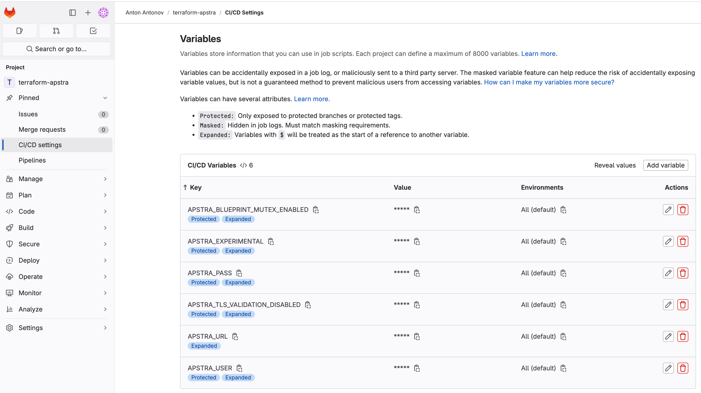

* Create a ``provider.tf`` file and add information about the Terraform provider (Juniper/apstra) and the usage of the GitLab backend as a storage for [Terraform states](https://docs.gitlab.com/ee/user/infrastructure/iac/terraform_state.html). You can find my ``provider.tf`` file below:
```
$ cat provider.tf
terraform {
  required_providers {
    apstra = {
      source = "Juniper/apstra"
    }
  }
  backend "http" {}
}

provider "apstra" {
  tls_validation_disabled = true
  experimental            = true
  blueprint_mutex_enabled = false
}
``` 

Now the infrastructure is ready and you can proceed with EVPN VXLAN fabric configuration in the DevNetOps way. In the next section, I will show you how to set up a fabric with a single commit.


### DevNetOps in Action 
Terraform requires you to describe the final state of the system, i.e. the set of resources that need to be configured in Apstra. The official list of supported resources and configuration examples can be found [here](https://registry.terraform.io/providers/Juniper/apstra/latest/docs). Numerous examples are also available in [this](https://github.com/Juniper/terraform-apstra-examples/) Github repository.

For the sake of convenience, I have distributed Apstra Terraform resources among different files. However, you can configure all of them in a single file, which would not make any difference for Terraform. Let's have a look at the high level overview of the recources I'm going to configure:

1\. [``agent_profile.tf``](https://github.com/agantonov/terraform-apstra/blob/main/agent_profile.tf) 
* The resource "apstra_agent_profile" creates an Agent Profile.

As per the [documentation](https://registry.terraform.io/providers/Juniper/apstra/latest/docs/resources/agent_profile), credentials cannot be set using this resource. You need to create this resources manually in the Apstra UI and set credentials for the devices.

2\. [``devices.tf``](https://github.com/agantonov/terraform-apstra/blob/main/devices.tf)
* The resource "apstra_managed_device" creates off-box agents.
* The resource "apstra_managed_device_ack" acknowledges each agent with the derived SN.

3\. [``resources.tf``](https://github.com/agantonov/terraform-apstra/blob/main/resources.tf)
* The resource "apstra_ipv4_pool" creates IPv4 address pool.
* The resource "apstra_asn_pool" creates ASN pool.
* The resource "apstra_vni_pool" creates VNI pool.

4\. [``tag.tf``](https://github.com/agantonov/terraform-apstra/blob/main/tag.tf)
* The resource "apstra_tag" creates tags.

5\. [``design.tf``](https://github.com/agantonov/terraform-apstra/blob/main/design.tf)
* The resource "apstra_logical_device" creates a logical device.
* The resource "apstra_interface_map" creates an interface map.
* The resource "apstra_rack_type" creates a rack.
* The resource "apstra_template_rack_based" creates a rack-based template.

6\. [``blueprint.tf``](https://github.com/agantonov/terraform-apstra/blob/main/blueprint.tf)
* The resource "apstra_datacenter_blueprint" instantiates a blueprint from the previously-created template.
* The resource "apstra_datacenter_resource_pool_allocation" assigns previously-created resource pools.
* The resource "apstra_datacenter_device_allocation" assigns interface maps and deploy mode.
* The resource "apstra_blueprint_deployment" deploys the blueprint.

7\. [``vn.tf``](https://github.com/agantonov/terraform-apstra/blob/main/vn.tf)
* The resource "apstra_datacenter_routing_zone" creates routing zones (VRFs).
* The resource "apstra_datacenter_resource_pool_allocation" assigns loopbacks and VNIs for each routing zone.
* The resource "apstra_datacenter_virtual_network" creates VNs per routing zone.
* The resource "apstra_datacenter_resource_pool_allocation" assigns VNIs for each VN.

8\. [``ct.tf``](https://github.com/agantonov/terraform-apstra/blob/main/ct.tf)
* The resource "apstra_datacenter_connectivity_template" creates connectivity template.
* The resource "apstra_datacenter_connectivity_template_assignments" assigns CT to application points. 

Now everything is set up and you are ready to experience CI/CD with GitLab, Terraform and Apstra. All you have to do is to commit and push the files to the GitLab repository.
```
$ git commit -m "Clos fabric deployment"
[detached HEAD f79a59c] Clos fabric deployment
 1 file changed, 2 insertions(+), 3 deletions(-)
$ git push origin HEAD:main
Enumerating objects: 5, done.
Counting objects: 100% (5/5), done.
Delta compression using up to 12 threads
Compressing objects: 100% (3/3), done.
Writing objects: 100% (3/3), 313 bytes | 313.00 KiB/s, done.
Total 3 (delta 2), reused 0 (delta 0), pack-reused 0
To server-14a:agantonov/terraform-apstra.git
   4ec08e1..f79a59c  HEAD -> main
```
This *push* triggers a sequence of jobs defined in the GitLab CI/CD pipeline. They are: ``fmt``, ``validate``, ``kics-iac-sast``,``build``,``deploy`` and ``cleanup``. The last job is manual, you can run it in case you want to eliminate the resources created by Terraform in Apstra. 
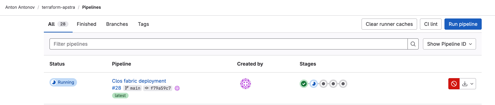

Let's take a look at what each job runs in the background:

* The *fmt* job runs the ``gitlab-terraform fmt`` script which executes ``terraform fmt`` in check mode to verify the format of configuration files.
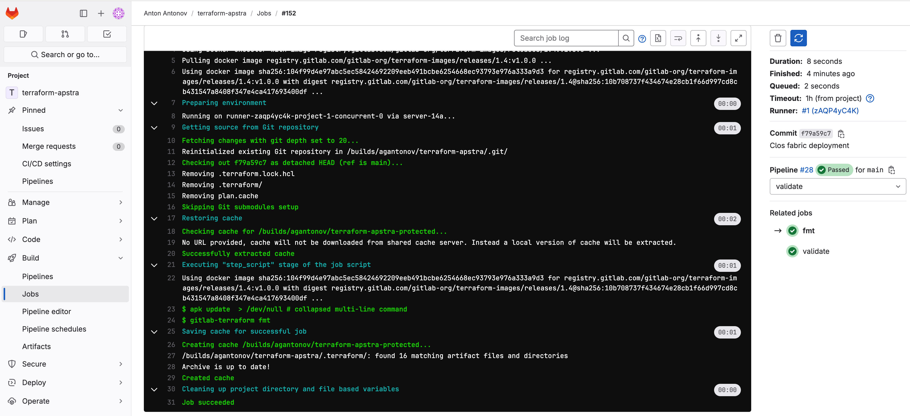

* The *validate* job runs the ``gitlab-terraform validate`` script which executes ``terraform validate`` to validate configuration files in the directory.
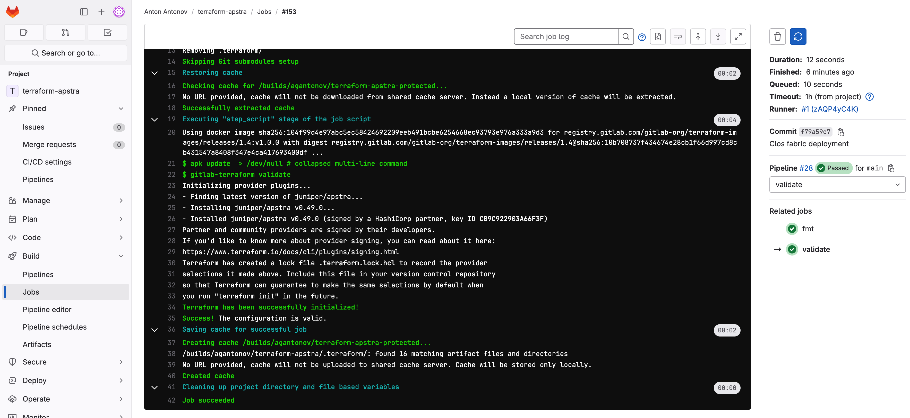

* The *kics-iac-sast* job checks your infrastructure definition files for known vulnerabilities.
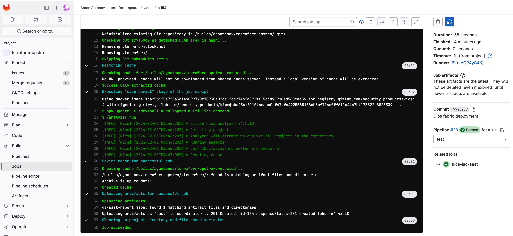

* The *build* job runs the ``gitlab-terraform plan`` script which executes ``terraform plan`` to create an execution plan. This plan which allows you to preview the changes that Terraform plans to make to your infrastructure.
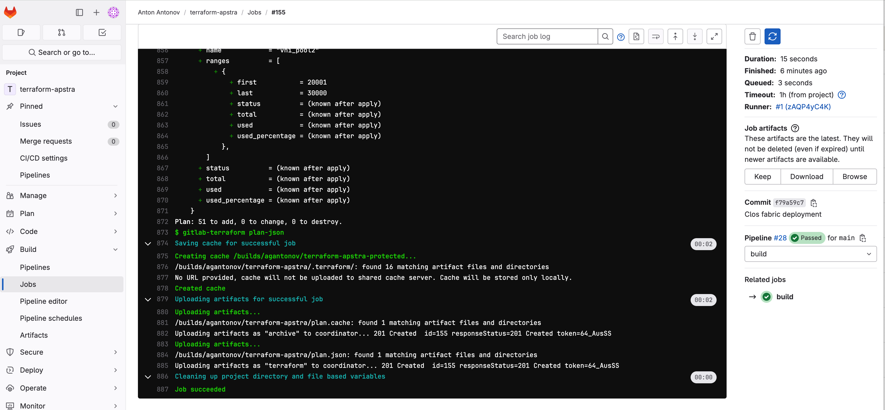

* The *deploy* job runs the ``gitlab-terraform apply`` script which executes ``terraform apply`` to carry out the actions proposed in the Terraform plan. This includes creating, updating, or destroying infrastructure.
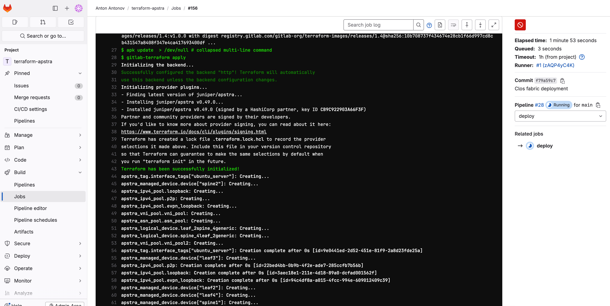

* The *cleanup* job (manual job) runs the ``gitlab-terraform destroy`` script which executes ``terraform destroy`` to destroy all remote objects managed by a particular Terraform configuration.
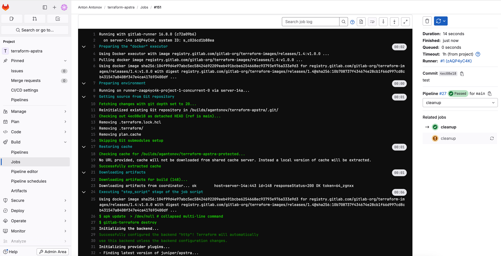


Now let's check what is happening in Apstra.

All devices are discovered, acknowledged and assigned to the blueprint DC1.
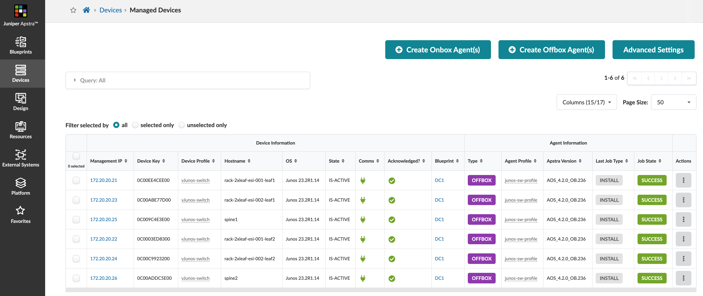


Blueprint DC1 and virtual networks are successfully created.
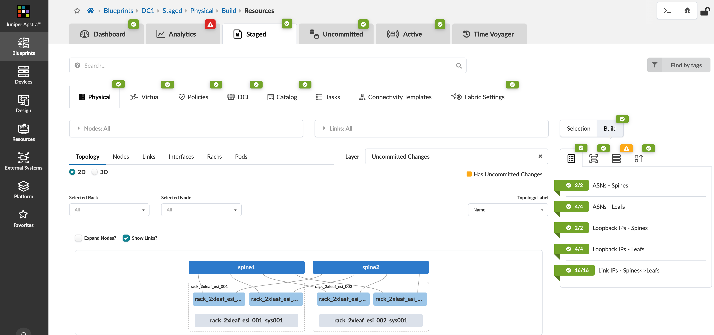

Connectivity templates are assigned to the application points.
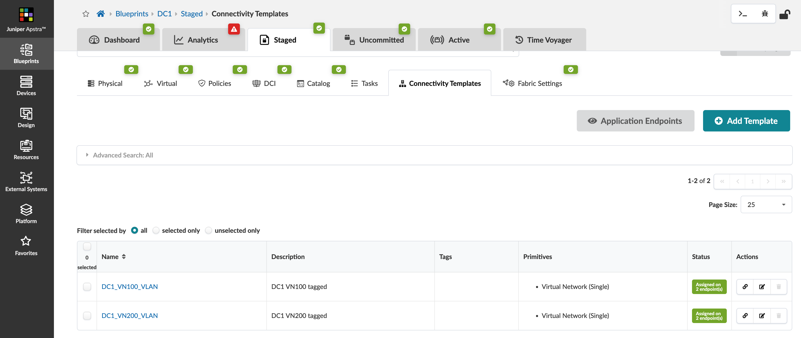

MAC IP entries are installed in the corresponding MAC-VRF routing instances.
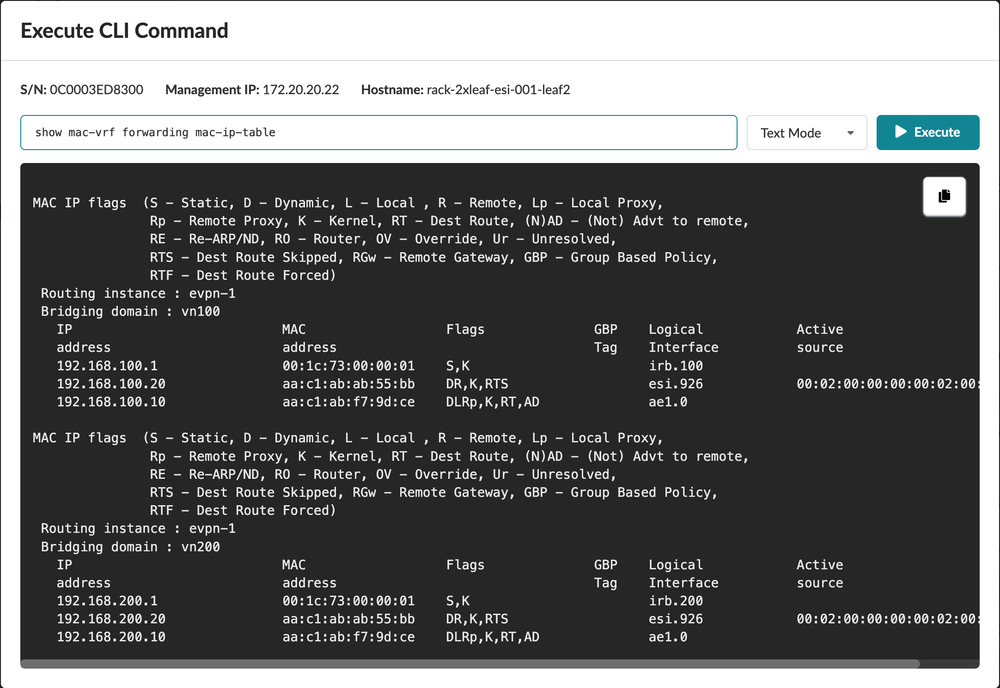

Server1 can ping Server2 via both virtual networks VN100 and VN200:
```
aantonov@serv1:~$ ping 192.168.100.20
PING 192.168.100.20 (192.168.100.20) 56(84) bytes of data.
64 bytes from 192.168.100.20: icmp_seq=1 ttl=64 time=3.11 ms
^C
--- 192.168.100.20 ping statistics ---
1 packets transmitted, 1 received, 0% packet loss, time 0ms
rtt min/avg/max/mdev = 3.111/3.111/3.111/0.000 ms
aantonov@serv1:~$ ping 192.168.200.20
PING 192.168.200.20 (192.168.200.20) 56(84) bytes of data.
64 bytes from 192.168.200.20: icmp_seq=1 ttl=64 time=3.38 ms
64 bytes from 192.168.200.20: icmp_seq=2 ttl=64 time=2.89 ms
^C
--- 192.168.200.20 ping statistics ---
2 packets transmitted, 2 received, 0% packet loss, time 1001ms
rtt min/avg/max/mdev = 2.889/3.135/3.382/0.246 ms
```

If you need to make any changes to the current setup, you can create, delete or update a Terraform definition of Apstra resources, commit and push the configuration. Gitlab and Terraform will perform the neccesarry changes in the Apstra instance which, in turn, will push the configuration to the switches.

---
This is an example of how Apstra integration with Terraform can help you to manage your data center physical infrastrature as a code.

